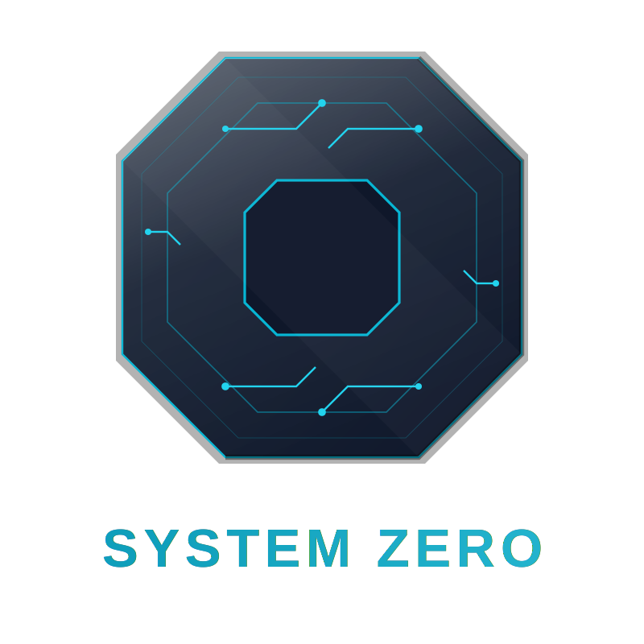

<div align="center">
  
</div>

# ZERO-TASK: The Auditable Task Engine

Zero-Task is a professional-grade, multi-user task management platform built with a **Sovereign Monorepo** architecture. It follows the "System Zero" methodology, emphasizing auditability, deterministic state, and containment.

## 🏗️ Architecture (Monorepo)

- **`apps/web`**: React 19 + Vite frontend. Glassmorphism UI with Framer Motion.
- **`apps/server`**: Hono API engine. High-performance, TypeScript-native.
- **`packages/shared`**: Shared domain types and logic (Single Source of Truth).
- **`Infrastructure`**: PostgreSQL + Better Auth for secure, collaborative state.

## Features

- **Multi-User Collaboration**: Assign tasks to users and group them into projects.
- **Auditability**: All actions (Add, Edit, Toggle, Delete, Assign) are tracked and verifiable in a centralized audit table.
- **Sovereign Persistence**: PostgreSQL database for robust, relational data storage.
- **Better Auth**: Professional-grade authentication with support for Social, Email, and Passkeys.
- **Testing**: Comprehensive test suite using Vitest and React Testing Library.

## Getting Started

### Local Development

1. **Prerequisites**: [Docker Desktop](https://www.docker.com/products/docker-desktop/) installed.
2. **Setup Workspaces**:
   ```bash
   npm install --legacy-peer-deps
   ```
3. **Run Dev Environment**:
   ```bash
   npm run dev
   ```
   *This command starts PostgreSQL (Docker), the Hono Server, and the Vite Frontend simultaneously.*

### Production Deployment (Containment)

The project is fully containerized for deterministic deployment.

1. **Build and Run with Docker**:
   ```bash
   docker build -t zero-task .
   docker run -p 8080:80 zero-task
   ```

2. **Run with Docker Compose**:
   ```bash
   docker-compose up --build
   ```

The application will be available at `http://localhost:8080`.

### Automated Staging Deployment

The project includes automated deployment to staging via GitHub Actions.

**Setup Instructions**:

1. **Create a Render Web Service**:
   - Go to [Render Dashboard](https://dashboard.render.com)
   - Click "New" → "Web Service"
   - Connect your GitHub repository
   - Select "Docker" as the runtime
   - Deploy the service

2. **Configure Deploy Hook**:
   - In Render service settings, navigate to "Deploy Hook" section
   - Copy the Deploy Hook URL
   - Go to GitHub repository → Settings → Secrets and variables → Actions
   - Add new secret: `RENDER_DEPLOY_HOOK` with the copied URL

3. **Automatic Deployment**:
   - Every push to `main` branch will:
     1. Run tests and linting
     2. Build the application
     3. Trigger Render deployment (if secret is configured)

**Manual Deployment**:
```bash
# Trigger deployment manually from GitHub Actions tab
# Navigate to "Deploy to Staging" workflow → "Run workflow"
```

## Documentation

The application uses a **Composition Root** pattern in `App.tsx`, with a custom hook `useTasks` managing the core logic and persistence.

- **Storage**: Browser `localStorage` (Key: `zero-task-data`)
- **State Flow**: Unidirectional data flow from `useTasks` -> `App` -> `Components`.
- **Verification**: Automated CI/CD via GitHub Actions (`verify.yml`) for linting, testing, and building.

## System Zero Principles

This project serves as a proof-of-concept for "System Zero" engineering:
1. **Sovereign Architecture**: Multi-user capability without sacrificing performance.
2. **Auditable Integrity**: End-to-end type safety between Frontend and Backend via shared types.
3. **Portable Containment**: Docker-first infrastructure for deterministic deployments.
