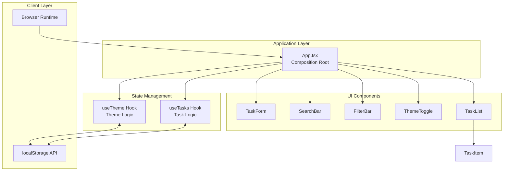
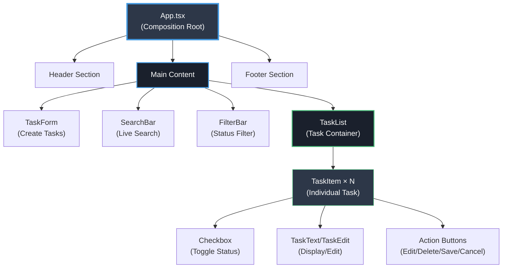
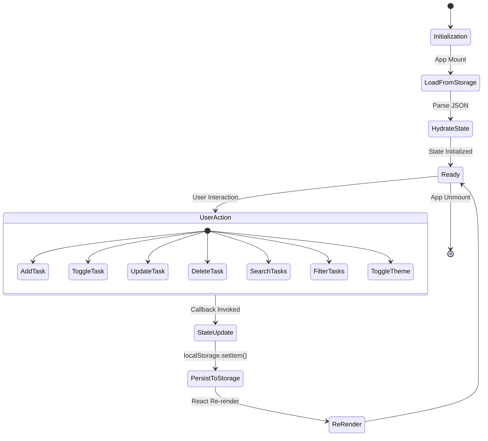
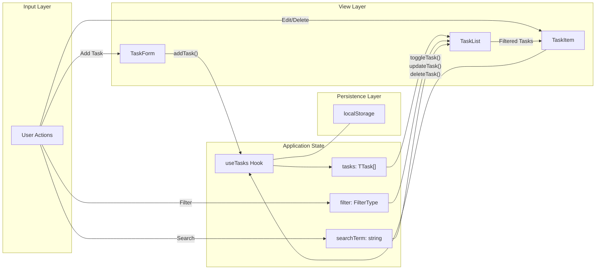
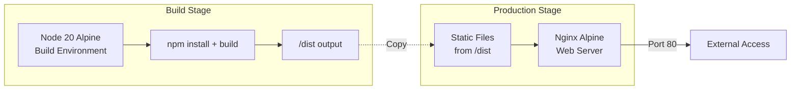
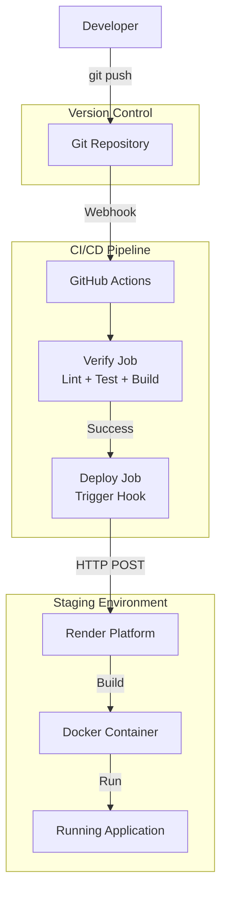

# System Architecture

## Overview

**ZERO-TASK** is a production-grade task management application built on "System Zero" engineering principles, emphasizing **auditability**, **containment**, and **deterministic behavior**.

## Architecture Style

**Single Page Application (SPA)** with a **Composition Root** pattern and **Local-First** data persistence.

## High-Level Architecture

## Component Hierarchy

## State Flow Architecture

## Data Flow Diagram

## Container Architecture

The application runs in a **multi-stage Docker container**:

## Technology Stack

| Layer | Technology | Purpose |
|-------|-----------|---------|
| **Frontend** | React 19 | UI Framework |
| **Language** | TypeScript | Type Safety |
| **Build Tool** | Vite | Fast bundling |
| **State** | React Hooks | Local state management |
| **Persistence** | localStorage | Client-side storage |
| **Styling** | CSS Modules | Scoped styles |
| **Testing** | Vitest + RTL | Unit/Component tests |
| **Containerization** | Docker | Production deployment |
| **CI/CD** | GitHub Actions | Automated verification |

## Deployment Architecture

## Security & Containment

1. **No External Dependencies**: All data stored client-side
2. **Immutable Builds**: Docker ensures identical deployments
3. **Type Safety**: TypeScript prevents runtime type errors
4. **Test Coverage**: 19/19 tests ensure behavior verification
5. **Non-root User**: Docker runs with minimal privileges

## Performance Characteristics

- **Initial Load**: < 100ms (Vite optimization)
- **State Updates**: < 16ms (React batching)
- **Persistence**: Synchronous localStorage writes
- **Build Size**: ~200KB gzipped
- **Docker Image**: ~50MB (Alpine-based)
