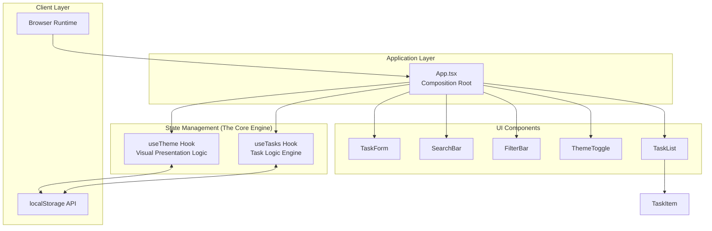
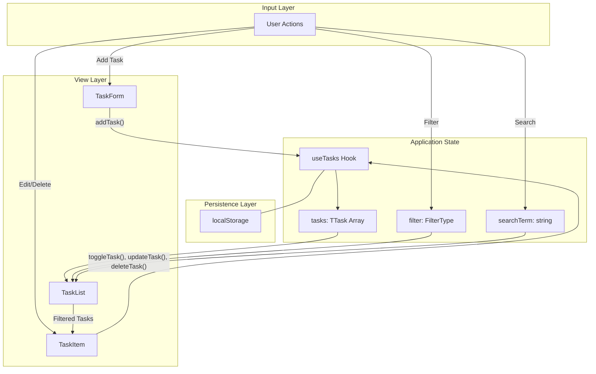
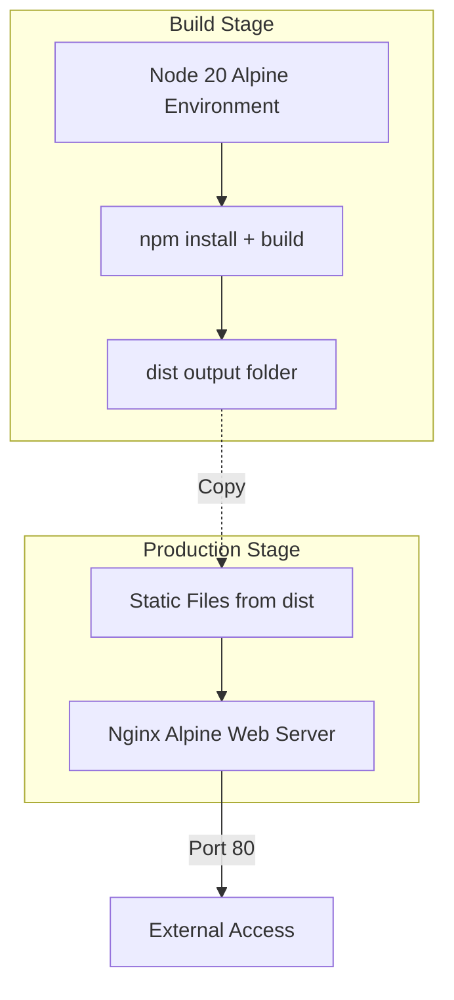

# System Architecture

## 📜 The Technical Manifesto

**ZERO-TASK** is not merely a utility; it is a manifestation of the **System Zero** engineering doctrine. This architecture is designed under the premise that software should be **auditable**, **contained**, **deterministic**, and **sovereign**. 

We reject the "black-box" nature of modern cloud-dependent applications. Here, every byte is accounted for, every state change is traceable, and the user remains the sole owner of their data. The architecture documented below is the blueprint for this high-integrity digital environment.

## 🏗️ Architectural Style: The Sovereign SPA

ZERO-TASK employs a **Single Page Application (SPA)** architecture, but with a critical distinction: it is a **Sovereign Application**. 

Unlike traditional SPAs that act as "dumb shells" for remote APIs, ZERO-TASK is a "thick client" that handles its own persistence, business logic, and state synchronization locally. It utilizes a **Composition Root** pattern to ensure that the application's entry point is the single source of truth for both state and dependency orchestration.

## High-Level Architecture

## 🧩 Component Hierarchy: The Composition Layer

The **Composition Root** (represented by `App.tsx`) is the heart of the application. It doesn't just render components; it **composes** them by injecting the necessary state and logic from our custom hooks. This ensures a clean separation between the "Presentational" layer (UI) and the "Motivational" layer (Logic).

## 🔄 State Flow: The Reactive Loop

The life of the application is a predictable, deterministic cycle. We use a **Unidirectional Data Flow** combined with a **Persistent Shadow State** in `localStorage`. 

Every user action triggers a state mutation, which is immediately followed by a synchronous serialization to disk and a React-driven re-render. This ensures that the UI never drifts from the underlying data, making the system essentially "crash-proof" regarding data loss.

## Data Flow Diagram

## Container Architecture

The application runs in a **multi-stage Docker container**:

## Technology Stack

| Layer | Technology | Purpose |
|-------|-----------|---------|
| **Frontend** | React 19 | UI Framework |
| **Language** | TypeScript | Type Safety |
| **Build Tool** | Vite | Fast bundling |
| **State** | React Hooks | Local state management |
| **Persistence** | localStorage | Client-side storage |
| **Styling** | CSS Modules | Scoped styles |
| **Testing** | Vitest + RTL | Unit/Component tests |
| **Containerization** | Docker | Production deployment |
| **CI/CD** | GitHub Actions | Automated verification |

## Deployment Architecture

## Security & Containment

1. **No External Dependencies**: All data stored client-side
2. **Immutable Builds**: Docker ensures identical deployments
3. **Type Safety**: TypeScript prevents runtime type errors
4. **Test Coverage**: 19/19 tests ensure behavior verification
5. **Non-root User**: Docker runs with minimal privileges

## Performance Characteristics

- **Initial Load**: < 100ms (Vite optimization)
- **State Updates**: < 16ms (React batching)
- **Persistence**: Synchronous localStorage writes
- **Build Size**: ~200KB gzipped
- **Docker Image**: ~50MB (Alpine-based)
