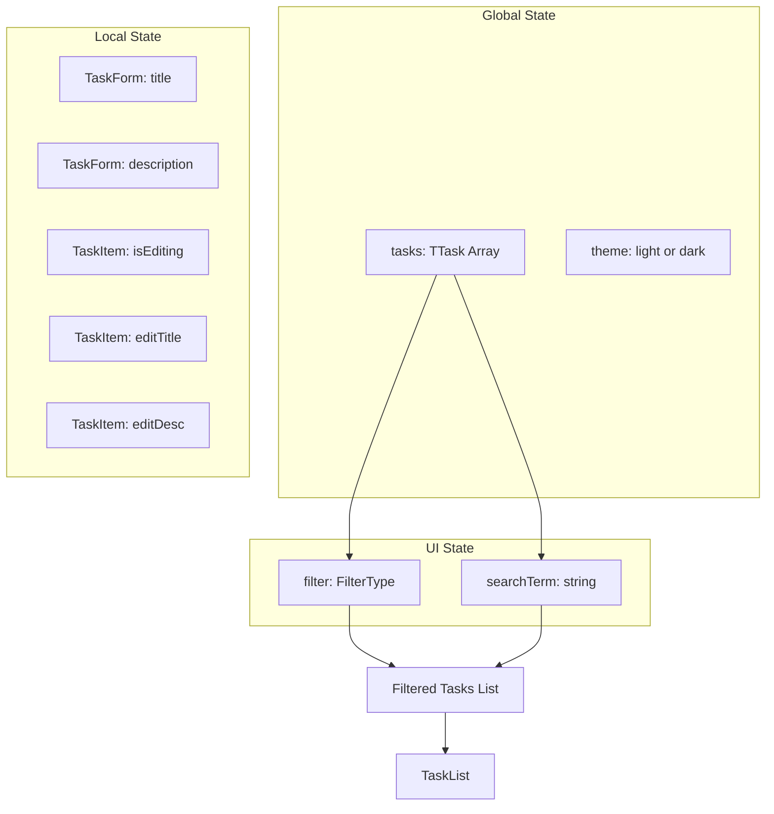
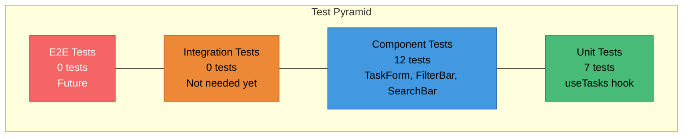

# System Design & Pattern Doctrine

## Design Philosophy: System Zero

The **ZERO-TASK** application is built on **System Zero engineering principles**, which emphasize:

1. **Auditability**: Every state change is traceable and verifiable
2. **Containment**: Self-sufficient operation without external dependencies
3. **Determinism**: Reproducible builds and predictable behavior
4. **Sovereignty**: User control over their data

## 🎨 Aesthetic Theory: Layered Clarity

The visual identity of **ZERO-TASK** is driven by the principle of **Layered Clarity**. We employ a **Glassmorphism-lite** aesthetic—not merely for modern vanity, but as a functional metaphor for the system's transparency.

- **Dynamic Interaction**: Hover states and micro-animations (implemented via Framer Motion) provide immediate tactile feedback, reinforcing the "Reactive Loop" architecture.
- **Visual Hierarchy**: Shadows and gradients are used to define the "Z-index of importance," ensuring the user's focus is always on the task at hand.
- **Glassmorphism**: Translucent panels represent the "Containment" principle, allowing the background depth to exist without distracting from the primary task interface.

## Design Patterns

### 1. Composition Root (The Orchestrator)
- **Concept**: Centralize all dependency injection and state management.
- **In ZERO-TASK**: `App.tsx` serves as the orchestrator. It instantiates the `useTasks` and `useTheme` logic engines and distributes their outputs to the visual components. This prevents "prop drilling" and keeps the components pure and predictable.

The `App.tsx` component serves as the **Composition Root**, responsible for:
- Initializing the state management hook (`useTasks`)
- Coordinating UI state (filter, search)
- Passing callbacks to child components

**Benefits**:
- Clear dependency injection
- Centralized state initialization
- Simplified testing (mock at the root)

### 2. Custom Hook Pattern (The Logic Container)
- **Concept**: Encapsulate complex business logic and stateful behavior into reusable, isolated units.
- **In ZERO-TASK**: Logic for persistence, filtering, and CRUD operations is expunged from the components and housed in `useTasks.ts`. This allows us to test the "Brain" of the application independently from the "Body" (UI).

The `useTasks` hook encapsulates all state logic:

```typescript
export const useTasks = () => {
  const [tasks, setTasks] = useState<TTask[]>(() => {
    // Hydrate from localStorage
  });

  useEffect(() => {
    // Persist to localStorage
  }, [tasks]);

  // CRUD operations
  const addTask = useCallback(...);
  const toggleTask = useCallback(...);
  const updateTask = useCallback(...);
  const deleteTask = useCallback(...);

  return { tasks, addTask, toggleTask, updateTask, deleteTask };
};
```

### 3. Theme State Pattern

The `useTheme` hook manages visual presentation:

```typescript
export const useTheme = () => {
  const [theme, setTheme] = useState<Theme>(() => {
    // Hydrate from localStorage
  });

  useEffect(() => {
    // Apply [data-theme] to documentElement
    // Persist to localStorage
  }, [theme]);

  return { theme, toggleTheme };
};
```

**Benefits**:
- Centralized theme control
- Persistent user preference
- Decoupled from task logic

**Benefits**:
- Separation of concerns (logic vs. presentation)
- Reusable across components
- Testable in isolation

### 3. Controlled Component Pattern

All form inputs use React's **controlled component** pattern:

```typescript
<input
  type="text"
  value={title}
  onChange={(e) => setTitle(e.target.value)}
/>
```

**Benefits**:
- Single source of truth (React state)
- Predictable behavior
- Easy validation

### 4. Presentational vs. Container Pattern

Components are split into two categories:

**Presentational** (Pure UI):
- `TaskItem` - Displays a task
- `FilterBar` - Displays filter buttons
- `SearchBar` - Displays search input
- `ThemeToggle` - Displays sun/moon toggle

**Container** (State Logic):
- `App` - Manages global state
- `TaskList` - Filters and maps tasks

## State Management Strategy

### State Architecture



### Why localStorage?

**Advantages**:
- Zero latency (synchronous API)
- No network dependency
- Survives browser restart
- ~10MB storage limit (sufficient for thousands of tasks)

**Limitations Acknowledged**:
- Single-device only
- No multi-user support
- Vulnerable to cache clearing

**Future**: Can be extended to IndexedDB for larger datasets or CRDTs for sync.

## UI/UX Design Principles

### Glassmorphism Aesthetic

The app uses a **dark glassmorphism** design language:

```css
.glass-bg {
  background: rgba(30, 41, 59, 0.7);
  backdrop-filter: blur(12px);
  border: 1px solid rgba(255, 255, 255, 0.1);
}
```

**Why?**
- Modern, premium feel
- Depth perception through layering
- Reduced eye strain (dark mode)

### Design Tokens

All visual properties are centralized in `tokens.css`:

```css
:root {
  /* Colors */
  --bg-primary: #0f172a;
  --text-primary: #f8fafc;
  --accent-primary: #06b6d4;
  
  /* Spacing */
  --space-md: 1rem;
  
  /* Borders */
  --radius-md: 0.5rem;
}
```

**Benefits**:
- Consistent design language
- Easy theme switching
- Maintainable codebase

### Micro-interactions

Subtle animations enhance UX:

```css
.task-item:hover {
  transform: translateY(-2px);
  transition: transform 0.2s ease;
}
```

## 🧪 Testing Strategy: The Doctrine of Determinism

We do not test for "coverage" as a metric; we test for **certainty**. Our strategy is a hybrid model that prioritizes the most critical paths of the "Sovereign SPA".

### 1. The Mock-Free Philosophy
We prefer testing our hooks and components against real, albeit virtualized, environments. Our `useTasks` tests use actual `localStorage` mocks to ensure that the serialization logic—the most fragile part of a local-first app—is 100% deterministic.

### 2. Component Isolation
Every UI component is treated as a "Deterministic View Function". Given a specific set of props (state), the component MUST render the exact same UI 100% of the time, without side effects.

### Test Pyramid



### Test Coverage

| Layer | Coverage | Tools |
|-------|----------|-------|
| **Unit Tests** | 7 tests | Vitest |
| **Component Tests** | 12 tests | React Testing Library |
| **E2E Tests** | 0 tests | Playwright (future) |

**Philosophy**: Focus on critical paths (state mutations, user interactions) over 100% coverage.

## Error Handling

### Input Validation

```typescript
const addTask = useCallback((title: string, description: string) => {
  if (!title.trim()) return; // Silent fail
  // ... create task
}, []);
```

**Strategy**: Fail silently for UX (no error modals), but prevent invalid state.

### Persistence Errors

```typescript
try {
  localStorage.setItem(STORAGE_KEY, JSON.stringify(tasks));
} catch (e) {
  console.error('Failed to persist tasks', e);
  // Degrade gracefully (in-memory only)
}
```

## Performance Optimizations

### 1. React.memo for TaskItem

```typescript
export const TaskItem = React.memo(({ task, onToggle, ... }) => {
  // Only re-render if task object changes
});
```

### 2. useCallback for Stable References

```typescript
const addTask = useCallback((title, desc) => {
  // Function reference stays stable across renders
}, []);
```

### 3. Vite Code Splitting

Vite automatically splits vendor code for optimal caching.

## Accessibility Considerations

- **Semantic HTML**: `<button>`, `<input>`, `<label>`
- **ARIA Labels**: `aria-label="Delete task"`
- **Keyboard Navigation**: Tab order preserved
- **Color Contrast**: WCAG AA compliant

## Scalability Considerations

| Aspect | Current | Future |
|--------|---------|--------|
| **Storage** | localStorage (10MB) | IndexedDB (unlimited) |
| **Search** | Client-side filter | Full-text search index |
| **Sync** | Single-device | CRDT-based multi-device |
| **Users** | Single-user | Multi-tenant with auth |

## Security Design

1. **No Server**: Eliminates server-side attack vectors
2. **CSP Headers**: Nginx can add Content Security Policy
3. **XSS Protection**: React escapes all user input
4. **No Secrets**: No API keys or tokens in client code

## Deployment Design

### Docker Multi-Stage Build

**Stage 1: Build**
- Install dependencies
- Compile TypeScript
- Bundle assets

**Stage 2: Production**
- Copy only `/dist` output
- Serve via Nginx
- Minimal attack surface

**Result**: 50MB production image vs. 500MB+ with node_modules.
