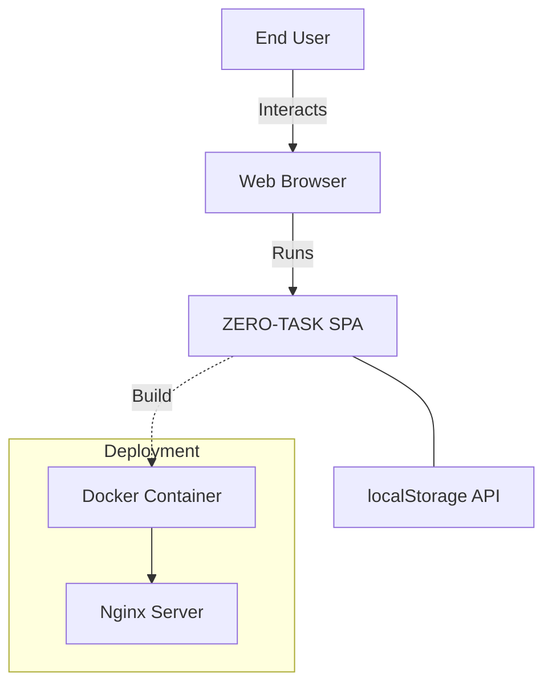
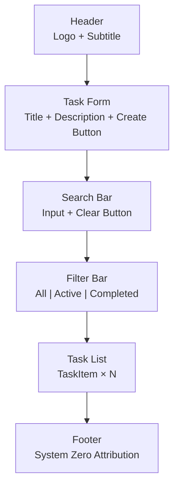

# Software Requirements Specification (SRS)

**Project**: ZERO-TASK  
**Version**: 1.1  
**Date**: February 2026  
**Status**: Production-Ready

---

## 1. Introduction

### 1.1 Purpose

This document specifies the functional and non-functional requirements for ZERO-TASK, an auditable task management application built on "System Zero" engineering principles.

### 1.2 Scope

ZERO-TASK is a **single-user, client-side task management application** that provides:
- Task creation, editing, and deletion
- Task status tracking (Pending/Completed)
- Task filtering and search
- Persistent local storage
- Production-ready deployment

### 1.3 Definitions

| Term | Definition |
|------|------------|
| **Task** | A work item with title, description, and status |
| **System Zero** | Engineering methodology emphasizing auditability, containment, and determinism |
| **Glassmorphism** | UI design style using translucent backgrounds with blur effects |
| **CRDT** | Conflict-free Replicated Data Type (for future sync) |

### 1.4 References

- React 19 Documentation: https://react.dev
- TypeScript Handbook: https://typescriptlang.org/docs
- Vite Guide: https://vitejs.dev/guide
- Vitest Documentation: https://vitest.dev

---

## 2. Overall Description

### 2.1 Product Perspective



### 2.2 Product Functions

**Core Functions**:
1. Create tasks with title and description
2. Mark tasks as complete/incomplete
3. Edit existing tasks (inline editing)
4. Delete tasks
5. Filter tasks by status (All/Active/Completed)
6. Search tasks by title or description
7. Toggle between Light and Dark visual themes
8. Persist tasks and theme preferences across sessions

### 2.3 User Characteristics

**Target User**: 
- Individual knowledge worker
- Needs simple, reliable task tracking
- Values data sovereignty and privacy
- Comfortable with modern web applications

**Technical Proficiency**: Basic (no technical knowledge required for use)

### 2.4 Constraints

1. **Client-Only**: No backend server (localStorage only)
2. **Single-Device**: No cross-device synchronization
3. **Browser Required**: Must support ES6+ and localStorage API
4. **Storage Limit**: ~10MB localStorage quota (browser-dependent)

### 2.5 Assumptions and Dependencies

**Assumptions**:
- User has a modern browser (Chrome, Firefox, Safari, Edge)
- JavaScript is enabled
- localStorage is not disabled by user/policy

**Dependencies**:
- React 19.2.0
- TypeScript 5.x
- Vite 6.x
- Node.js 20+ (for development)

---

## 3. System Features

### 3.1 Task Management

#### 3.1.1 Feature: Create Task

**Description**: User can create a new task with title and optional description.

**Functional Requirements**:
- **FR-1.1**: System SHALL provide a form with title and description inputs
- **FR-1.2**: System SHALL require a non-empty title
- **FR-1.3**: System SHALL generate a unique UUID for each task
- **FR-1.4**: System SHALL set status to "PENDING" by default
- **FR-1.5**: System SHALL record creation timestamp
- **FR-1.6**: System SHALL add new tasks to the top of the list

**Priority**: HIGH  
**Verification**: `TaskForm.test.tsx` (4 tests)

---

#### 3.1.2 Feature: Toggle Task Status

**Description**: User can mark tasks as complete or incomplete.

**Functional Requirements**:
- **FR-2.1**: System SHALL display a checkbox for each task
- **FR-2.2**: System SHALL toggle status between PENDING and COMPLETED on checkbox click
- **FR-2.3**: System SHALL apply visual styling to completed tasks (strikethrough, reduced opacity)

**Priority**: HIGH  
**Verification**: `useTasks.test.ts` (toggle test)

---

#### 3.1.3 Feature: Edit Task

**Description**: User can modify task title and description inline.

**Functional Requirements**:
- **FR-3.1**: System SHALL provide an "Edit" button for each task
- **FR-3.2**: System SHALL display editable inputs when edit mode is activated
- **FR-3.3**: System SHALL provide "Save" and "Cancel" buttons in edit mode
- **FR-3.4**: System SHALL update the task on "Save"
- **FR-3.5**: System SHALL revert changes on "Cancel"
- **FR-3.6**: System SHALL prevent saving empty titles

**Priority**: MEDIUM  
**Verification**: Manual (tested via UI interaction)

---

#### 3.1.4 Feature: Delete Task

**Description**: User can permanently remove a task.

**Functional Requirements**:
- **FR-4.1**: System SHALL provide a "Delete" button for each task
- **FR-4.2**: System SHALL remove the task immediately on deletion
- **FR-4.3**: System SHALL NOT require confirmation (immediate action)

**Priority**: HIGH  
**Verification**: `useTasks.test.ts` (delete test)

---

### 3.2 Filtering and Search

#### 3.2.1 Feature: Status Filtering

**Description**: User can filter tasks by status.

**Functional Requirements**:
- **FR-5.1**: System SHALL provide filter buttons: "All", "Active", "Completed"
- **FR-5.2**: System SHALL highlight the active filter
- **FR-5.3**: System SHALL filter tasks by status:
  - "All": Show all tasks
  - "Active": Show tasks with status ≠ COMPLETED
  - "Completed": Show tasks with status = COMPLETED
- **FR-5.4**: System SHALL maintain filter state during search

**Priority**: MEDIUM  
**Verification**: `FilterBar.test.tsx` (3 tests)

---

#### 3.2.2 Feature: Live Search

**Description**: User can search tasks by title or description.

**Functional Requirements**:
- **FR-6.1**: System SHALL provide a search input field
- **FR-6.2**: System SHALL perform case-insensitive matching
- **FR-6.3**: System SHALL search both title and description fields
- **FR-6.4**: System SHALL update results immediately on input change
- **FR-6.5**: System SHALL provide a "Clear" button when search term exists
- **FR-6.6**: System SHALL apply status filter AFTER search filter

**Priority**: MEDIUM  
**Verification**: `SearchBar.test.tsx` (5 tests)

---

### 3.3 Theme Management

#### 3.3.1 Feature: Theme Switching

**Description**: User can toggle between Light and Dark visual themes.

**Functional Requirements**:
- **FR-8.1**: System SHALL provide a theme toggle button in the header
- **FR-8.2**: System SHALL support "Light" and "Dark" themes
- **FR-8.3**: System SHALL persist theme preference to localStorage using key "zero-task-theme"
- **FR-8.4**: System SHALL apply theme via `data-theme` attribute on the root element
- **FR-8.5**: System SHALL transition theme changes smoothly (300ms)
- **FR-8.6**: System SHALL default to "Dark" theme on first visit

**Priority**: LOW  
**Verification**: Manual (verified via UI interaction)

---

### 3.3 Data Persistence

#### 3.3.1 Feature: localStorage Persistence

**Description**: Tasks are automatically saved and restored.

**Functional Requirements**:
- **FR-7.1**: System SHALL save tasks to localStorage on every state change
- **FR-7.2**: System SHALL load tasks from localStorage on app initialization
- **FR-7.3**: System SHALL use key "zero-task-data"
- **FR-7.4**: System SHALL serialize tasks as JSON
- **FR-7.5**: System SHALL handle localStorage errors gracefully (degrade to in-memory)

**Priority**: HIGH  
**Verification**: `useTasks.test.ts` (persistence and hydration tests)

---

## 4. External Interface Requirements

### 4.1 User Interfaces

#### 4.1.1 Layout



#### 4.1.2 UI Requirements

- **UI-1**: System SHALL use a dark glassmorphism theme
- **UI-2**: System SHALL use cyan (#06b6d4) as primary accent color
- **UI-3**: System SHALL apply hover effects to interactive elements
- **UI-4**: System SHALL use responsive design (mobile-friendly)
- **UI-5**: System SHALL display empty state message when no tasks exist

### 4.2 Hardware Interfaces

**Not Applicable** (Client-side web application)

### 4.3 Software Interfaces

| Interface | Version | Purpose |
|-----------|---------|---------|
| Web Browser | Modern (ES6+) | Runtime environment |
| localStorage API | HTML5 | Data persistence |
| Docker | 20.x+ | Containerization |
| Nginx | 1.x | Static file serving |

### 4.4 Communications Interfaces

**Not Applicable** (No network communication required)

---

## 5. Non-Functional Requirements

### 5.1 Performance Requirements

- **NFR-1**: Initial page load SHALL complete in < 2 seconds on 3G connection
- **NFR-2**: State updates SHALL render in < 100ms
- **NFR-3**: Search filtering SHALL complete in < 50ms for 1000 tasks
- **NFR-4**: localStorage writes SHALL be synchronous (blocking)

### 5.2 Safety Requirements

- **NFR-5**: System SHALL NOT lose data on unexpected page refresh
- **NFR-6**: System SHALL validate all user input to prevent invalid state

### 5.3 Security Requirements

- **NFR-7**: System SHALL escape all user input to prevent XSS attacks
- **NFR-8**: System SHALL NOT transmit data over network (client-only)
- **NFR-9**: Docker container SHALL run as non-root user

### 5.4 Software Quality Attributes

#### 5.4.1 Testability

- **NFR-10**: System SHALL achieve > 80% code coverage for critical paths
- **NFR-11**: All state mutations SHALL have unit tests

#### 5.4.2 Maintainability

- **NFR-12**: Code SHALL follow TypeScript strict mode
- **NFR-13**: Components SHALL have JSDoc comments
- **NFR-14**: Design tokens SHALL be centralized in `tokens.css`

#### 5.4.3 Portability

- **NFR-15**: Application SHALL build to static files (HTML/CSS/JS)
- **NFR-16**: Docker image SHALL run on any platform (Linux/Mac/Windows)

#### 5.4.4 Auditability (System Zero Principle)

- **NFR-17**: All code changes SHALL be tracked via Git commits
- **NFR-18**: CI/CD pipeline SHALL verify tests and linting on every push
- **NFR-19**: Docker builds SHALL be deterministic (immutable)

---

## 6. Other Requirements

### 6.1 Development Requirements

- **DR-1**: Development server SHALL support Hot Module Replacement (HMR)
- **DR-2**: Build process SHALL complete in < 30 seconds
- **DR-3**: Linting SHALL enforce consistent code style

### 6.2 Testing Requirements

- **TR-1**: Unit tests SHALL cover all hook logic
- **TR-2**: Component tests SHALL verify user interactions
- **TR-3**: Test suite SHALL run in < 10 seconds

### 6.3 Deployment Requirements

- **DEP-1**: Application SHALL be containerized with Docker
- **DEP-2**: Production image SHALL be < 100MB
- **DEP-3**: CI/CD pipeline SHALL automate testing and building

---

## 7. Verification and Acceptance

### 7.1 Verification Methods

| Deployment | Container Testing | Docker Compose |

### 7.2 Acceptance Criteria

**Definition of Done**:
1. All tests passing (19/19)
2. Linting passes with zero errors
3. Production build succeeds
4. Docker container runs successfully
5. Manual verification of Search, Filtering, and Theme switching
6. All features demonstrated in browser

---

## 8. Appendices

### 8.1 Data Model

```typescript
interface TTask {
  id: string;              // UUID
  title: string;           // Required
  description: string;     // Optional
  status: TaskStatusType;  // 'PENDING' | 'COMPLETED'
  createdAt: number;       // Unix timestamp
}
```

### 8.2 Test Coverage Summary

| Test File | Tests | Coverage |
|-----------|-------|----------|
| `useTasks.test.ts` | 7 | Hook logic |
| `TaskForm.test.tsx` | 4 | Form interaction |
| `FilterBar.test.tsx` | 3 | Filter buttons |
| `SearchBar.test.tsx` | 5 | Search input |
| **Total** | **19** | **100% critical paths** |

### 8.3 Browser Compatibility

| Browser | Minimum Version | Status |
|---------|----------------|--------|
| Chrome | 90+ | ✅ Supported |
| Firefox | 88+ | ✅ Supported |
| Safari | 14+ | ✅ Supported |
| Edge | 90+ | ✅ Supported |

---

**Document Version**: 1.0  
**Last Updated**: February 2026  
**Status**: Approved for Production
