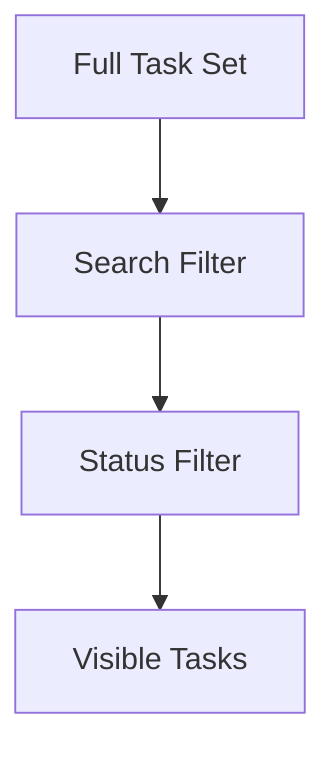

# Discovery Logic: Filtering & Search

This document outlines the logic for data discovery within the **ZERO-TASK** engine. Discovery is the mechanism by which the **Sovereign Individual** navigates their local data lake.

## 🧩 Conceptual Alignment
- **Reactive Loop**: Discovery logic is additive and reactive. The UI is a pure function of the filtered task set.
- **Case-Insensitive Integrity**: Search assumes a flexible, user-centric matching strategy while maintaining strict data types.

## Functional Mapping
| Requirement | Logic Description | Implementation Reference |
|-------------|-------------------|--------------------------|
| **FR-5.x** | Status Filtering | `TaskList.tsx` / `App.tsx` |
| **FR-6.x** | Text-Based Search | `TaskList.tsx` / `SearchBar.tsx` |

---

## 1. Filter Priority Logic

In **ZERO-TASK**, discovery is a two-pass process where Search and Filtering are additive.

### 1.1 The Filtering Matrix (FR-5)
| Filter Mode | Logic Rule |
|-------------|------------|
| **All** | `return true` (No filtering) |
| **Active** | `task.status === 'PENDING'` |
| **Completed** | `task.status === 'COMPLETED'` |

---

## 2. Search Algorithm (FR-6)

### 2.1 Matching Criteria
The system uses a case-insensitive partial match across two primary fields:
1. **Task Title**
2. **Task Description**

### 2.2 Logic Sequence
1. **Normalize**: Convert `searchTerm` to lowercase.
2. **Scan**: Check if Normalized Term is a substring of `task.title.toLowerCase()` OR `task.description.toLowerCase()`.

---

## 3. Additive Filtering Logic

The final visible list results from the intersection of both search and status filters.

**Calculation Order:**
1. Apply **Search Filter** to the full task set.
2. Apply **Status Filter** to the results of step 1.

### Edge Cases:
- **Empty Search + 'All' Filter**: Shows all tasks.
- **Search Term 'xyz' + 'Completed' Filter**: Only shows completed tasks containing 'xyz'.
