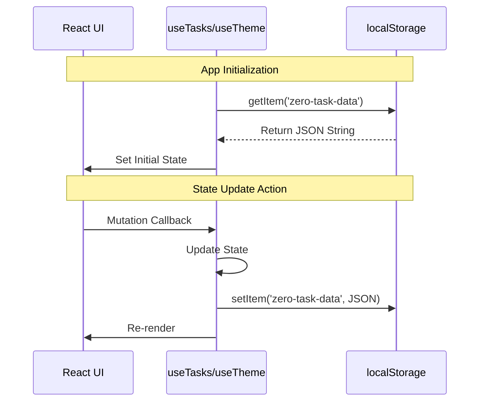

# System & persistence Logic

This document details the internal system mechanics for data durability and visual themes.

## Functional Mapping
| Requirement | Logic Description | Implementation Reference |
|-------------|-------------------|--------------------------|
| **FR-7.x** | Persistent storage | `useTasks.ts` |
| **FR-8.x** | Visual Theme Engine | `useTheme.ts` |

---

## 1. Persistence Logic (FR-7)

### 1.1 The Sync Cycle
Persistence is handled via the **Web Storage API (localStorage)**.

1. **Hydration**: On app mount, the system reads `zero-task-data`.
    - If found: Parse JSON and initialize state.
    - If missing: Initialize with empty array `[]`.
2. **Synchronization**: Every state change triggers an effect that serializes the entire task array to JSON and writes it to `localStorage`.

### 1.2 Constraint Handling
- **Failure Mode**: If `localStorage` is blocked or full, the system logs a console error and continues in-memory only. This ensures the app remains functional for the current session.

---

## 2. Theme Engine Logic (FR-8)

### 2.1 Theme Propagation
The theme engine uses **CSS Variables** and **Data Attributes** for a zero-JS-cost styling update (once applied).

1. **State**: The `theme` variable holds either `light` or `dark`.
2. **Propagation**: The engine applies `[data-theme]` to the `document.documentElement`.
3. **Transition**: A global transition rule in `tokens.css` ensures all variable-linked colors fade smoothly.

### 2.2 Persistence
Theme preference is stored separately in `zero-task-theme` to ensure the user's visual preference is restored immediately upon page load, preventing "theme flickers".

---

## 3. Persistence Diagram

