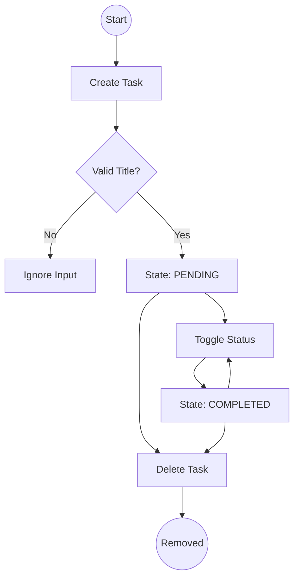

# Task Management Logic: The Atomic Units

This document details the business rules and state transitions for task lifecycle management. In **ZERO-TASK**, a task is not just a string; it is an **Atomic Unit of Intent**.

## 🧩 Conceptual Alignment
- **Immutability**: Every task update produces a new object reference, adhering to the "System Zero" principle of deterministic state transitions.
- **Traceability**: Each task carries its own metadata (ID, Timestamp), ensuring it remains a discrete, auditable record.

## Functional Mapping
| Requirement | logic Description | Implementation Reference |
|-------------|-------------------|--------------------------|
| **FR-1.x** | Task Creation & Validation | `addTask` in `useTasks.ts` |
| **FR-2.x** | Completion State Toggling | `toggleTask` in `useTasks.ts` |
| **FR-3.x** | Attribute Modification | `updateTask` in `useTasks.ts` |
| **FR-4.x** | Record Expungement | `deleteTask` in `useTasks.ts` |

---

## 1. Creation Logic (FR-1)

### 1.1 Validation Rules
- **Title Constraint**: Tasks MUST have a non-empty title after trimming whitespace.
- **Description Intent**: Descriptions are optional and defaults to an empty string if not provided.

### 1.2 State Initialization
When a task is instantiated:
1. `id`: Generated via `crypto.randomUUID()` to ensure collision-free local state.
2. `status`: Initialized to `PENDING`.
3. `createdAt`: Capture system time via `Date.now()`.

---

## 2. Transition Logic (FR-2 & FR-3)

### 2.1 The "Toggle" Rule
The transition between `PENDING` and `COMPLETED` is a binary flip. 
- **Rule**: Toggling a task does not modify its `createdAt` or `id`.
- **Constraint**: A completed task can be moved back to pending at any time.

### 2.2 Modification Constraints
Users can edit the `title` and `description` of any task.
- **Save Rule**: Updates are rejected if the new title is empty.
- **Immutability**: Every update creates a new task object reference to ensure React state consistency.

---

## 3. Deletion Logic (FR-4)

### 3.1 Immutable Removal
- **Action**: Deletion is immediate and non-reversible in the current ephemeral/localStorage layer.
- **System Behavior**: The task is filtered out of the state array entirely.

---

## 4. State Flow Diagram

